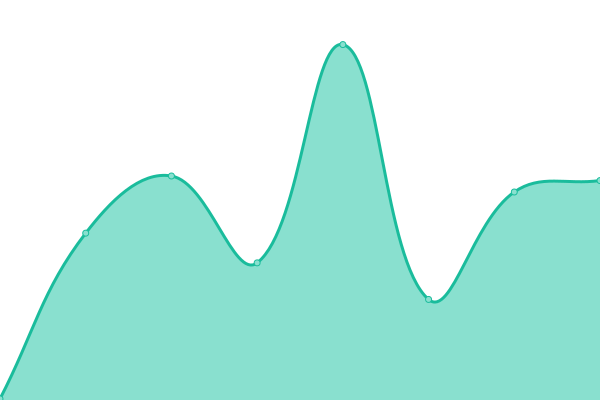
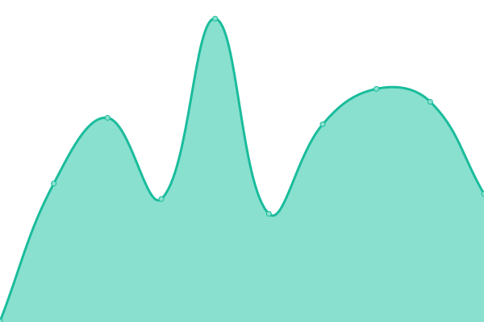

# [📈 Live Status](https://pablokbs.github.io): <!--live status--> **🟧 Partial outage**

This repository contains the open-source uptime monitor and status page for [Upptime](https://upptime.js.org), powered by [Upptime](https://github.com/upptime/upptime).

With [Upptime](https://upptime.js.org), you can get your own unlimited and free uptime monitor and status page, powered entirely by a GitHub repository. We use [Issues](https://github.com/upptime/upptime/issues) as incident reports, [Actions](https://github.com/pablokbs/upptime/actions) as uptime monitors, and [Pages](https://pablokbs.github.io) for the status page.

<!--start: status pages-->
<!-- This summary is generated by Upptime (https://github.com/upptime/upptime) -->
<!-- Do not edit this manually, your changes will be overwritten -->
<!-- prettier-ignore -->
| URL | Status | History | Response Time | Uptime |
| --- | ------ | ------- | ------------- | ------ |
|  [Grupo Dimakers](https://grupodimakers.com) | 🟩 Up | [grupo-dimakers.yml](https://github.com/jesusm0920/upptime/commits/HEAD/history/grupo-dimakers.yml) | 

 574ms
     
 | 

<a href="https://jesusm0920.github.io/upptime/history/grupo-dimakers">100.00%</a>
    

|  [IDM dev](https://idmdev.tech) | 🟩 Up | [idm-dev.yml](https://github.com/jesusm0920/upptime/commits/HEAD/history/idm-dev.yml) | 

 411ms
     
 | 

<a href="https://jesusm0920.github.io/upptime/history/idm-dev">100.00%</a>
    

|  [Puente](https://apis.idmdev.tech) | 🟩 Up | [puente.yml](https://github.com/jesusm0920/upptime/commits/HEAD/history/puente.yml) | 

 296ms
     
 | 

<a href="https://jesusm0920.github.io/upptime/history/puente">100.00%</a>
    

|  [Delivery](https://delivery-to.com/administrador/) | 🟩 Up | [delivery.yml](https://github.com/jesusm0920/upptime/commits/HEAD/history/delivery.yml) | 

 178ms
     
 | 

<a href="https://jesusm0920.github.io/upptime/history/delivery">100.00%</a>
    

|  [AGSAL](https://digital.aguasdesaltillo.com) | 🟩 Up | [agsal.yml](https://github.com/jesusm0920/upptime/commits/HEAD/history/agsal.yml) | 

 268ms
     
 | 

<a href="https://jesusm0920.github.io/upptime/history/agsal">100.00%</a>
    

|  [WH Tools](https://wh.tools) | 🟩 Up | [wh-tools.yml](https://github.com/jesusm0920/upptime/commits/HEAD/history/wh-tools.yml) | 

 2639ms
     
 | 

<a href="https://jesusm0920.github.io/upptime/history/wh-tools">100.00%</a>
    

|  [Aguillon](https://aguillon.com.mx) | 🟩 Up | [aguillon.yml](https://github.com/jesusm0920/upptime/commits/HEAD/history/aguillon.yml) | 

 6556ms
     
 | 

<a href="https://jesusm0920.github.io/upptime/history/aguillon">100.00%</a>
    

|  [Lennox Reclutamiento](https://lennoxreclutamiento.com) | 🟩 Up | [lennox-reclutamiento.yml](https://github.com/jesusm0920/upptime/commits/HEAD/history/lennox-reclutamiento.yml) | 

 250ms
     
 | 

<a href="https://jesusm0920.github.io/upptime/history/lennox-reclutamiento">100.00%</a>
    

|  [Lennox Bot Reclutamiento](https://bot.lennoxreclutamiento.com) | 🟩 Up | [lennox-bot-reclutamiento.yml](https://github.com/jesusm0920/upptime/commits/HEAD/history/lennox-bot-reclutamiento.yml) | 

 171ms
     
 | 

<a href="https://jesusm0920.github.io/upptime/history/lennox-bot-reclutamiento">100.00%</a>
    

|  [Lennox Bot Salary](https://botsalary.lennoxreclutamiento.com) | 🟥 Down | [lennox-bot-salary.yml](https://github.com/jesusm0920/upptime/commits/HEAD/history/lennox-bot-salary.yml) | 

 157ms
     
 | 

<a href="https://jesusm0920.github.io/upptime/history/lennox-bot-salary">100.00%</a>
    

|  [Lennox Bot PTU](https://lennoxformeremployee.lennoxreclutamiento.com/) | 🟩 Up | [lennox-bot-ptu.yml](https://github.com/jesusm0920/upptime/commits/HEAD/history/lennox-bot-ptu.yml) | 

 160ms
     
 | 

<a href="https://jesusm0920.github.io/upptime/history/lennox-bot-ptu">100.00%</a>
    

|  [Platinados](https://platinados.platco.net) | 🟩 Up | [platinados.yml](https://github.com/jesusm0920/upptime/commits/HEAD/history/platinados.yml) | 

 271ms
     
 | 

<a href="https://jesusm0920.github.io/upptime/history/platinados">92.85%</a>
    

|  [Plating](https://plating.platco.net) | 🟩 Up | [plating.yml](https://github.com/jesusm0920/upptime/commits/HEAD/history/plating.yml) | 

 268ms
     
 | 

<a href="https://jesusm0920.github.io/upptime/history/plating">95.14%</a>
    

<!--end: status pages-->

[**Visit our status website →**](https://pablokbs.github.io)

## 📄 License

- Powered by: [Upptime](https://github.com/upptime/upptime)
- Code: [MIT](./LICENSE) © [Upptime](https://upptime.js.org)
- Data in the `./history` directory: [Open Database License](https://opendatacommons.org/licenses/odbl/1-0/)
